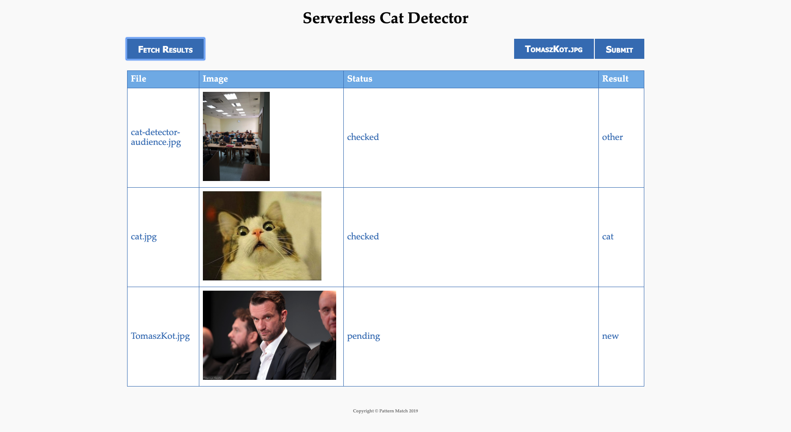

# serverless-cat-detector

## Motivation



Cats are cute, but *sneaky* animals. They can hide in almost any corner, and remain undetected for hours. Let's leverage *AWS* and *Serverless* approach to built together a **CatDetector** - an app that will help us finding our favorite pupils in an infinite stream of images!

Repository is a foundation for an interactive workshops. To get more info about workshops - why we do it and how we do it, read the following blog post: https://pattern-match.com/blog/2019/06/21/serverless-cat-detector-natywna-chmura-15-06-2019/

We have performed it on following conferences:

- [Cloudyna 2017](https://cloudyna.net) (*Katowice*, *Poland*).
- [Natywna Chmura 2019](https://natywnachmura.pl/serverless-w-praktyce/) (*Kraków*, Poland).
- [Natywna Chmura 2019](https://evenea.pl/event/natywna-chmura-serverless-w-praktyce-katowice-10-2019) (*Katowice*, Poland).

During that we covered following topics:

- *AWS Lambda*,
- *AWS X-Ray*,
- *AWS S3*,
- *AWS DynamoDB*,
- *AWS Rekognition*,
- [*Serverless Framework*](https://serverless.com),
- *Best practices*, when it comes to development of such applications.

## How to use this repository?

This instructions assumes that your have Node.js and AWS CLI installed and properly configured. 

Repository contains 3 subdirectories
* **cat-recognition** - this is code of all the lambdas and infrastructure definitions used on the backend side.
* **user-interface** - contains simple user interface that can interact with the backend. It can be run locally of from remote server/S3 Bucket.
* **infrastructure** - this is cloud formation template for creating users for our workshop.

### Backend

To automatically deploy you need to have [Serverless Framework](https://serverless.com) installed. You can do it locally withing the repo or globally using the following command:

`npm install -g serverless`

#### Deployment
When you have it just change a directory to cat-recognition and to deploy it run:

`sls deploy`

You should see something like this on the output:

```
Serverless: Packaging service...
Serverless: Excluding development dependencies...
Serverless: Tracing ENABLED for function "serverless-cat-detector-dev-uploadcatpicture"
Serverless: Tracing ENABLED for function "serverless-cat-detector-dev-getresults"
Serverless: Tracing ENABLED for function "serverless-cat-detector-dev-catrekognition"
Serverless: Uploading CloudFormation file to S3...
Serverless: Uploading artifacts...
Serverless: Uploading service serverless-cat-detector.zip file to S3 (26.08 MB)...
Serverless: Validating template...
Serverless: Updating Stack...
Serverless: Checking Stack update progress...
............................
Serverless: Stack update finished...
Service Information
service: serverless-cat-detector
stage: dev
region: eu-west-1
stack: serverless-cat-detector-dev
resources: 23
api keys:
  None
endpoints:
  POST - https://slanmziaqh.execute-api.eu-west-1.amazonaws.com/dev/upload
  GET - https://slanmziaqh.execute-api.eu-west-1.amazonaws.com/dev/results
functions:
  uploadcatpicture: serverless-cat-detector-dev-uploadcatpicture
  getresults: serverless-cat-detector-dev-getresults
  catrekognition: serverless-cat-detector-dev-catrekognition
layers:
  None
Serverless: Removing old service artifacts from S3...
Serverless: Run the "serverless" command to setup monitoring, troubleshooting and testing.
```

If you want to delete all the resources issue:

`sls remove`

#### Testing

To run unit tests included in a repository simply run:

`npm test`

### User interface

As we mentioned before, user interface can be run either from localhost or remote location like server or S3 public website bucket. The only thing you need to remember of is to replace values present in `scripts.js` file with the endpoints returned by the deploy command from previous section

```
  const API_UPLOAD_ENDPOINT = "<your upload endpoint>"
  const API_RESULTS_ENDPOINT = "<your results endpoint>"
```
